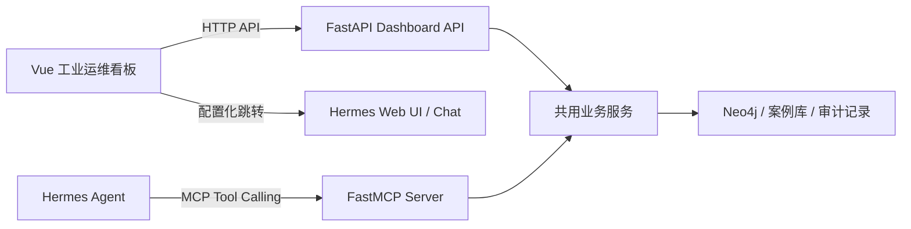

# 多工具调用工业运维 Agent

## 项目需求文档

| 项目项       | 内容                                                      |
| ------------ | --------------------------------------------------------- |
| 选题         | 多工具调用工业运维 Agent：设备故障查询 + 维修方案自动生成 |
| 所属领域     | 智能制造 / 工业运维                                       |
| 计划周期     | 一周 MVP                                                  |
| Agent 运行时 | Hermes Agent                                              |
| 核心技术     | Tool Calling、MCP、知识图谱、结构化输出、Docker           |
| 文档状态     | 需求与技术方案初稿                                        |
| 编写日期     | 2026-07-20                                                |

## 1. 项目结论

本项目不应重新开发一个 Agent 框架，而应把 Hermes Agent 作为通用的 Agent 运行时和编排层，把工业运维能力实现为独立、可测试、可替换的业务工具服务。

建议的最小闭环：

> 用户描述设备异常 → Hermes 识别任务并调用多个工业工具 → 查询设备与故障知识图谱 → 检索维修案例/SOP → 生成结构化维修方案 → 返回证据、风险和人工确认提示。

建议采用“项目级 Docker Compose + Hermes 官方镜像 + 自定义工业运维 MCP 服务 + Neo4j 知识图谱”的实现方式。这样可以把 Hermes 及其 Python、Node.js、Git Bash、uv 等运行依赖放进容器，只向宿主机暴露本地端口和当前项目目录下的必要数据目录。

需要明确：Docker 可以显著降低对宿主机的污染，但 Docker Desktop、镜像缓存和网络组件仍属于宿主机环境。本项目只使用项目级 Compose 资源和命名卷，不在宿主机原生安装 Hermes 依赖。

## 2. 项目背景与问题定义

工业现场的设备故障处理通常涉及：

- 设备编号、型号、产线位置、部件层级和历史状态；
- 报警码、现象描述、传感器异常、故障模式和可能原因；
- 维修手册、标准作业指导书、维修记录、备件和工器具；
- 安全隔离、停机确认、复测验收和升级处理规则。

传统问答只能返回一段文字，无法稳定完成“查设备—判断故障—找依据—规划维修—验证结果”的多步骤工作。本项目要证明的是：一个已经具备通用 Agent 能力的系统，经过领域工具和知识注入后，能够完成可追溯的工业运维辅助决策。

项目定位为“维修工程师的辅助决策系统”，不是自动控制设备，也不是替代有资质人员下达现场操作指令。任何真实维修动作都必须由人工确认。

## 3. 项目目标

### 3.1 总体目标

构建一个可以在本地一键启动的工业运维 Agent Demo。用户使用自然语言输入设备故障现象，Hermes Agent 自动选择并串联多个工具，查询结构化知识和非结构化资料，输出带证据和风险提示的维修方案。

### 3.2 必须达成的目标

1. Hermes 能正常启动并完成一次对话。
2. Hermes 能发现并调用自定义工业运维 MCP 工具。
3. 至少实现三类可观察工具调用：设备查询、故障/案例检索、维修方案生成。
4. 知识图谱中存在设备、部件、症状、故障、原因、维修动作、SOP、备件等实体及关系。
5. 输出方案必须包含来源证据、前置安全条件、维修步骤、所需工具/备件、验证方法和不确定性说明。
6. 全部服务可以通过 Docker Compose 启动、停止和清理。
7. 至少准备 3 个可重复运行的演示场景和对应验收结果。

### 3.3 一周内不纳入的内容

- 真实 PLC、机器人、MES、EAM/CMMS 的生产环境写入；
- 自动下发停机、开机、参数修改或执行维修动作；
- 训练自己的大语言模型；
- 完整企业级权限系统、工单系统和多租户系统；
- 为了展示“智能”而引入过多数据库、向量库或复杂前端。

## 4. 首先需要掌握的内容

### 4.1 第一优先级：必须掌握

#### A. Agent 和工具调用

- LLM 的消息、工具描述、参数 schema、工具结果和多轮循环；
- Agent 如何根据任务选择工具、组合工具和处理失败；
- 结构化输出：JSON schema、枚举、必填字段、校验与重试；
- 工具的幂等性、只读/写入边界、超时、错误返回和审计日志。

#### B. Hermes Agent 使用方式

- CLI、会话、模型/Provider 配置、工具开关；
- Skills 的作用：把稳定的领域工作流和输出要求写成可复用指令；
- MCP 的作用：把项目自己的工具服务注册为 Hermes 可发现的工具；
- Hermes 的 Docker terminal backend 与“直接把 Hermes 运行在 Docker 中”是两个不同概念；本项目采用后者作为主要隔离方式。

#### C. MCP 服务开发

- MCP server 的工具注册、参数校验和返回结果；
- stdio 与 HTTP 两种连接方式；
- Docker Compose 网络中的服务名访问；
- 工具命名、最小暴露面和敏感操作的人工确认。

#### D. 知识图谱与检索

- 节点、关系、属性、唯一标识和来源字段；
- 从设备故障资料中抽取实体和关系；
- 图查询与关键词/全文检索的配合；
- 证据链：每个结论如何回指到文档、案例或图谱关系。

### 4.2 第二优先级：应当掌握

- Python、Pydantic、异步调用和日志；
- Neo4j 基础 Cypher 查询；
- Dockerfile、Compose、网络、卷、环境变量和日志；
- 提示词设计、幻觉控制、拒答条件和安全边界；
- 评价集、测试用例、工具轨迹和方案质量评价。

前端部分还需要掌握 Vue 3 组件、TypeScript、Vite、Vue Router、HTTP 数据请求、加载/错误状态和基础数据可视化；不要求学习复杂 SSR。

### 4.3 可以暂缓

- 向量数据库和复杂 RAG 编排；
- 多 Agent 协作；
- 语音、消息平台、浏览器自动化；
- Hermes 源码级修改、原生工具开发和自定义模型训练。

## 5. 目标系统架构

~~~mermaid
flowchart LR
    U["维修人员自然语言问题"] --> H["Hermes Agent<br/>对话与任务编排"]
    H --> S["工业运维 Skill<br/>流程约束与输出格式"]
    H --> M["工业运维 MCP Server"]
    M --> G["Neo4j 知识图谱"]
    M --> C["维修案例与 SOP 文档库"]
    M --> V["规则校验与方案模板"]
    M --> A["审计日志"]
    M --> H
    H --> O["带证据的维修方案<br/>风险提示与人工确认"]
    X["宿主机 Codex / 浏览器 / curl"] -. localhost .-> H
~~~

### 5.1 各层职责

| 层                | 使用现成能力              | 本项目需要开发的内容                   |
| ----------------- | ------------------------- | -------------------------------------- |
| 对话与 Agent Loop | Hermes                    | 任务说明、领域 Skill、模型配置         |
| 工具发现与调用    | Hermes MCP Client         | MCP server 配置和工具白名单            |
| 工业运维业务      | 无                        | 设备查询、故障检索、方案生成、规则校验 |
| 知识图谱          | 无                        | 图谱 schema、种子数据、Cypher 查询     |
| 资料检索          | 可自建                    | SOP、案例、设备资料的导入和检索        |
| 数据安全与审计    | 部分可复用                | 操作分类、日志、敏感工具禁用和确认机制 |
| 交互入口          | Vue 工业运维看板 + Hermes Web UI | 看板展示业务数据，Hermes 负责 Agent 对话 |

## 6. 基于 Hermes Agent 的开发方式

### 6.1 Hermes 直接复用的能力

Hermes 已经可以提供：

- Agent 循环、上下文管理、模型 Provider 切换和会话；
- 内置工具系统、工具集和工具调用结果处理；
- Skills：按需加载的领域工作流说明；
- MCP 客户端：发现并注册外部 HTTP/stdio 工具；
- 记忆、日志、CLI、Gateway 和可选 Dashboard；
- Docker、SSH 等执行后端。

这些部分不应在本项目中重复实现，否则一周时间会被消耗在框架开发而不是工业场景验证上。

### 6.2 本项目需要实现的扩展

#### 1）工业运维 Skill

建议目录：

~~~text
hermes/skills/industrial-maintenance/SKILL.md
~~~

Skill 应规定：

- 先确认设备身份，再分析故障；
- 查询结果不足时必须说明缺少什么信息；
- 先调用只读工具，禁止直接调用写入工具；
- 维修方案必须引用工具返回的证据；
- 涉及带电、高温、高压、旋转部件、化学品时必须给出安全提示；
- 不能把可能原因表述成确定事实；
- 任何工单创建或设备控制操作都必须停在人工确认前。

本项目不修改 Hermes Agent 源码，也不重复开发 Agent 聊天窗口。Hermes 的 Web UI 继续负责对话和 Provider 配置；项目新增一个独立的 Vue 工业运维看板，用于展示设备、问题、维修草案、外部资料和工具调用流程。

MCP 工具服务推荐使用 Python FastMCP 实现。由于新增看板需要让浏览器读取设备和历史数据，因此同时增加只读 HTTP 查询接口，推荐使用 FastAPI。FastAPI 只负责看板数据访问，不负责 Agent 循环；FastMCP 和 FastAPI 应复用同一套业务服务与数据查询逻辑。

#### 2）工业运维 MCP Server

建议作为独立 Python 服务开发，而不是修改 Hermes 源码。MCP 服务负责：

- 参数校验和业务查询；
- 访问 Neo4j 和案例库；
- 生成可审计的工具结果；
- 对写入类工具执行确认 token 校验；
- 对异常返回稳定的错误类型和可读错误信息。

#### 3）Hermes MCP 配置

在 Hermes 容器内，优先使用 Compose 服务名连接内部 MCP 服务，例如：

~~~yaml
mcp_servers:
  maintenance:
    url: "http://maintenance-mcp:8000/mcp"
    timeout: 30
    tools:
      include:
        - search_device
        - query_fault_candidates
        - retrieve_maintenance_evidence
        - draft_repair_plan
        - validate_repair_plan
~~~

实际 MCP 路径和传输方式以所采用的 Python MCP SDK 实现为准；如果使用 stdio，则让 Hermes 启动项目内的 MCP 进程。无论采用哪种方式，都应只暴露项目需要的工具。

#### 4）工具不是“让模型自由执行代码”

工具应做成窄接口，而不是提供任意 SQL 或任意 shell 工具。

| 工具                          | 作用                      | 类型 | 关键输入                         | 关键输出                     |
| ----------------------------- | ------------------------- | ---- | -------------------------------- | ---------------------------- |
| search_device                 | 按编号/型号/产线查询设备  | 只读 | device_id、model                 | 设备基本信息、部件树、状态   |
| query_fault_candidates        | 根据报警码/症状查候选故障 | 只读 | device_id、symptoms、alarm_codes | 候选故障、可能原因、匹配依据 |
| retrieve_maintenance_evidence | 查找 SOP、手册、历史案例  | 只读 | fault_id、关键词                 | 摘要、来源、章节、相关案例   |
| draft_repair_plan             | 按模板生成维修方案草案    | 计算 | 候选故障、证据                   | 步骤、工具、备件、风险、验证 |
| validate_repair_plan          | 校验缺失字段和安全约束    | 计算 | 方案 JSON                        | 校验结果、警告、阻断项       |
| create_work_order             | 创建模拟工单              | 写入 | 方案、确认 token                 | 工单编号、审计记录           |

一周 MVP 可以暂不实现 create_work_order，但应在设计中保留人工确认边界，以展示安全意识。

### 6.3 推荐的调用链

以“3 号输送机电机温度过高并伴随振动”为例：

1. Hermes 调用 search_device 确认设备和部件。
2. Hermes 调用 query_fault_candidates 查询高温、振动对应的故障候选。
3. Hermes 调用 retrieve_maintenance_evidence 获取轴承润滑 SOP 和相似维修案例。
4. Hermes 调用 draft_repair_plan 生成方案草案。
5. Hermes 调用 validate_repair_plan 检查停机、断电、复测等内容。
6. Hermes 汇总结果，输出方案、证据、风险和“需现场人员确认”的提示。

只读查询之间可以并行，但涉及共享状态、写入数据库或外部系统的工具不应默认并行。

## 7. 知识图谱与数据需求

### 7.1 最小实体集合

~~~text
Device        设备
Component     部件
Symptom       症状
Alarm         报警
Fault         故障模式
Cause         可能原因
RepairAction  维修动作
SOP           标准作业指导书
Case          历史维修案例
Tool          工器具
Part          备件
SafetyRule    安全规则
~~~

### 7.2 最小关系集合

~~~text
Device -[:HAS_COMPONENT]-> Component
Device -[:HAS_ALARM]-> Alarm
Symptom -[:INDICATES]-> Fault
Fault -[:MAY_BE_CAUSED_BY]-> Cause
Fault -[:FIXED_BY]-> RepairAction
RepairAction -[:REQUIRES_TOOL]-> Tool
RepairAction -[:REQUIRES_PART]-> Part
Fault -[:HAS_SOP]-> SOP
Case -[:ABOUT_DEVICE]-> Device
Case -[:RESOLVED_BY]-> RepairAction
RepairAction -[:REQUIRES_SAFETY]-> SafetyRule
~~~

### 7.3 数据来源和最低数据量

一周 MVP 不需要真实企业数据，可以构造一个自洽的脱敏数据集：

- 3 类设备、6～10 台设备实例；
- 10～15 个部件；
- 10 个左右报警/症状；
- 8～12 个故障模式及可能原因；
- 8～12 个维修动作；
- 5～8 个 SOP/维修案例；
- 每条资料带 source_id、标题、章节、版本和更新时间。

数据应以 CSV/JSON/Markdown 形式存放在项目中，通过导入脚本写入 Neo4j。所有演示结论必须能够回指到这些数据。

### 7.4 检索策略

MVP 采用混合策略即可：

1. 用设备编号、报警码和实体属性做精确查询；
2. 用 Cypher 沿“症状—故障—原因—维修动作”路径扩展；
3. 用关键词/全文检索获取 SOP 和案例片段；
4. 合并去重后交给 Hermes 生成最终方案；
5. 可选增加 embedding/vector retrieval，但不能让它成为一周交付的阻塞项。

## 8. 功能需求

### FR-01 设备信息查询

系统应支持按设备编号、设备型号、产线位置查询设备，并返回设备状态、部件层级和相关报警。

### FR-02 故障候选查询

系统应支持输入自然语言症状、报警码和设备部件，返回一个或多个候选故障，并说明匹配到的症状/报警依据。

### FR-03 维修资料检索

系统应返回与候选故障相关的 SOP、手册片段和历史案例，至少包含标题、来源标识和关键片段。

### FR-04 维修方案草案生成

方案应至少包含：

- 设备与故障对象；
- 当前判断和置信度/不确定性；
- 前置条件与安全措施；
- 分步骤维修动作；
- 所需工具、备件和人员要求；
- 预计停机或处理时间；数据不足时标记为估计；
- 维修完成后的验证方法；
- 失败时的升级路径；
- 证据来源。

### FR-05 方案校验

系统应检查方案是否缺少设备确认、断电/隔离、安全措施、验证步骤和升级条件。存在阻断项时，Agent 不得把方案表述为可直接执行。

### FR-06 多工具调用可追溯

演示中应能看到工具调用顺序、输入摘要、返回摘要和最终结论之间的关系。日志不得泄露 API Key。

### FR-07 不确定性处理

当设备不存在、症状冲突、证据不足或多个故障概率接近时，系统应提出补充问题或输出“需要人工确认”，不得编造确定结论。

### FR-08 可选模拟工单

如果时间允许，实现一个仅写入本地数据库的 create_work_order，要求显式传入人工确认 token，并记录操作者、时间、方案版本和证据引用。

## 9. 非功能需求

### NFR-01 可复现

新环境执行 README 中的命令后，应能启动所有服务并运行种子数据导入与演示脚本。

### NFR-02 隔离

- Hermes 和知识图谱运行在容器内；
- 只挂载当前项目所需目录；
- 禁止挂载整个用户目录、宿主机根目录或包含个人密钥的目录；
- API Key 通过 .env 或 Docker secrets 注入，不提交到 Git。

### NFR-03 可测试

- MCP 工具有参数校验和单元测试；
- 至少准备 3 个可重复演示场景；不强制建立独立的前端 Vitest、Playwright 或自动化 E2E 工程；
- 至少包含一个“设备不存在/证据不足”的失败场景。

### NFR-04 性能目标

在本地小数据集和正常网络条件下，一次完整问答应在 60 秒内返回；单个工具应有超时，超时后给出可解释错误。

### NFR-05 安全

- 写入或控制类工具默认禁用；
- 只读工具和写入工具分组；
- 对用户输入、文档内容和工具返回结果保持边界，防止提示词注入改变安全规则；
- 维修建议仅作为辅助信息，必须提示遵守现场规程和资质要求。

## 10. 最终项目成品

建议交付目录：

~~~text
.
├─ docs/
│  └─ 项目需求文档-多工具调用工业运维Agent.md
├─ data/
│  ├─ devices.csv
│  ├─ faults.csv
│  ├─ relations.csv
│  ├─ sop_cases/
│  └─ seed_neo4j.py
├─ services/
│  └─ maintenance-mcp/
│     ├─ pyproject.toml
│     ├─ app/
│     │  ├─ server.py          # FastMCP 工具入口
│     │  ├─ api.py             # FastAPI 看板查询接口
│     │  └─ domain/             # 共用业务逻辑
│     └─ tests/
├─ frontend/
│  ├─ package.json
│  ├─ src/
│  └─ tests/
├─ hermes/
│  ├─ config.example.yaml
│  └─ skills/industrial-maintenance/SKILL.md
├─ compose.yml
├─ .env.example
├─ scripts/
│  ├─ seed.ps1
│  ├─ seed.sh
│  └─ demo.py
├─ README.md
└─ evaluation/
   ├─ test_cases.yaml
   └─ sample_traces/
~~~

最终演示成品应能做到：

1. 运行一条 Compose 命令启动 Hermes、MCP 服务和 Neo4j；
2. 通过 Vue 看板查看设备状态、待处理问题和历史维修草案；
3. 从看板的“开始诊断/查看对话”入口跳转到 Hermes Web UI；
4. 展示多工具调用链和知识图谱中的设备—故障—维修关系；
5. 返回一份结构化、带证据和安全提醒的维修方案；
6. 用第二个场景证明系统会识别不确定性，而不是强行给答案；
7. 用一条清理命令停止并删除项目容器、卷和网络。

## 11. Docker 运行方案

本项目确定使用 Docker Compose，其他安装路径不纳入交付范围。

### 11.1 项目级 Docker Compose

建议采用以下隔离原则：

- 使用 Hermes 官方镜像作为基础，不在宿主机执行 Hermes 安装脚本；
- 自定义 MCP 服务和 Neo4j 也作为 Compose 服务；
- 仅使用当前项目下的 runtime/，或 Docker named volume 保存 Hermes 配置、会话和图数据库数据；
- 端口仅绑定到 127.0.0.1，例如 Hermes API 使用 127.0.0.1:8642、Hermes Dashboard 使用 127.0.0.1:9119；
- 不挂载整个 C:\Users\...，不把宿主机 PATH、SSH 密钥或全部环境变量传入容器；
- 将 .env 加入 .gitignore，只保留 .env.example；
- 容器之间通过 Compose 服务名访问，例如 maintenance-mcp:8000、neo4j:7687；
- 需要宿主机访问时，通过映射端口或仅挂载项目目录完成，不让 Hermes 自由访问宿主机文件系统。

典型操作流程：

~~~powershell
# 启动
docker compose up -d --build

# 查看服务状态与日志
docker compose ps
docker compose logs -f hermes

# 任务结束后删除本项目的容器、网络和 named volumes
docker compose down -v --remove-orphans
~~~

如果还需要清理项目专用镜像，应先确认镜像只由本项目使用，再删除对应镜像。不要使用指向整个 Docker 环境的全局清理命令。

## 12. 一周实施计划

### 第 1 天：范围和环境

- 确认 Hermes 版本、模型 Provider 和 API Key；
- 写 compose.yml、.env.example 和 README 启动说明；
- 让 Hermes 完成一次最小对话；
- 验证宿主机能访问本地端口。

### 第 2 天：数据与知识图谱

- 设计实体、关系和来源字段；
- 准备脱敏设备、故障、案例和 SOP 数据；
- 启动 Neo4j 并完成种子数据导入；
- 写 3～5 个基础 Cypher 查询。

### 第 3 天：MCP 工具

- 完成 search_device；
- 完成 query_fault_candidates；
- 完成 retrieve_maintenance_evidence；
- 为工具补充 schema、错误处理和单元测试。

### 第 4 天：方案生成与 Hermes 接入

- 完成 draft_repair_plan 和 validate_repair_plan；
- 编写工业运维 Skill；
- 注册 MCP server 并确认 Hermes 可以发现工具；
- 跑通一次完整工具调用链；
- 定义看板所需的 FastAPI 只读接口和返回 schema。

### 第 5 天：安全、证据和异常场景

- 增加来源引用和审计日志；
- 增加设备不存在、证据不足、症状冲突场景；
- 禁用写入类工具或增加人工确认 token；
- 固化结构化方案 schema；
- 使用 pnpm 创建 Vue 3/Vite 前端并完成总览、设备、问题、草案、资料和工作流页面。

### 第 6 天：测试与演示

- 编写至少 3 个端到端案例；
- 检查工具轨迹、响应时间和日志脱敏；
- 准备知识图谱截图、对话截图和方案样例；
- 实现工作流程时间线、ECharts 状态图和 Hermes Web UI 跳转；
- 录制或排练 10～15 分钟项目展示。

### 第 7 天：打包与报告

- 清理无关代码和密钥；
- 验证全新环境的启动与清理；
- 将 frontend 和 maintenance-service 加入 Compose；
- 完善 README、架构图、测试结果和局限性；
- 整理课程报告、PPT 和答辩问答。

## 13. 验收标准

### 13.1 功能验收

- [ ] Hermes 能通过 MCP 发现至少 4 个自定义工具。
- [ ] 正常场景能完成至少 3 次连续工具调用。
- [ ] 返回结果包含设备、故障判断、维修步骤、工具/备件、风险、验证和证据。
- [ ] 至少一个结果由知识图谱关系支撑，而不是仅由模型常识生成。
- [ ] 不存在设备或证据不足时，系统会追问/拒答/提示人工确认。
- [ ] 所有写入能力默认关闭或需要显式确认。

### 13.2 工程验收

- [ ] docker compose up -d --build 可启动项目。
- [ ] docker compose down -v --remove-orphans 可删除项目容器、卷和网络。
- [ ] .env、API Key 和个人文件未进入 Git。
- [ ] MCP 工具单元测试通过，至少 3 个端到端用例可复现。
- [ ] README 能让其他同学按步骤运行 demo。

### 13.3 展示验收

演示必须至少包含：

1. 已知设备 + 明确症状：展示完整多工具调用和方案生成。
2. 已知设备 + 多个可能故障：展示候选排序、不确定性和证据。
3. 未知设备或资料缺失：展示系统不会编造答案。

## 14. 主要风险与应对

| 风险                     | 应对                                                 |
| ------------------------ | ---------------------------------------------------- |
| Hermes 安装/模型配置耗时 | 第一时间只验证最小对话；业务服务与 Hermes 解耦       |
| MCP 传输细节不熟         | 先用最小只读工具跑通，再扩展工具数量                 |
| 知识图谱数据太少         | 使用自洽的脱敏种子数据，重视关系和证据链             |
| 模型输出不稳定           | 使用 Pydantic/schema 校验、固定 Skill 和方案模板     |
| Docker 端口或卷残留      | 所有资源使用项目 Compose 管理，结束时执行项目级 down |
| 宿主机泄露密钥/文件      | 只挂载项目目录，禁止全盘挂载，使用 .env 管理密钥     |
| 建议被误解为现场指令     | 明确辅助决策定位，写入和控制工具必须人工确认         |

## 15. 前端交互看板需求

### 15.1 页面定位与边界

新增前端不是第二个聊天 Agent，而是一个“工业运维业务看板”。它展示 Hermes Dashboard 不负责展示的业务信息：设备清单、设备运行状态、需要关注的问题、维修草案历史和本次 Agent 工作流程。

前端不直接连接 Neo4j，也不直接调用 MCP 工具。浏览器只访问后端提供的只读 HTTP 查询接口；Hermes 仍然通过 MCP 调用同一套业务逻辑。



### 15.2 前端技术栈

| 层次 | 选型 | 说明 |
|---|---|---|
| 前端框架 | Vue 3 + TypeScript | 使用 Composition API 实现业务看板；不使用 SSR |
| 构建工具 | Vite | 快速开发、HMR 和静态构建 |
| 路由 | Vue Router | 管理看板、设备详情、问题、资料、草案和流程详情路由 |
| 样式 | CSS Variables + 页面样式 | 统一颜色、间距、状态和响应式规则 |
| 组件 | Element Plus | 复用表格、表单、抽屉、标签、时间线等基础组件 |
| 数据请求 | 原生 Fetch 封装 | 处理必要的异步请求、加载、刷新和错误 |
| 图表 | Apache ECharts | 设备状态分布、问题趋势、流程耗时等可视化 |
| 包管理 | pnpm | 前端依赖安装和脚本执行 |
| 测试 | 浏览器定向检查 | 本 Demo 不额外建立 Vitest、Playwright 测试工程 |

当前页面采用“工业控制室”视觉方向：深色蓝灰背景、青色数据主色、琥珀色注意、红色告警、绿色正常；设备编号和报警码使用等宽字体。页面应有明确的信息层级和状态颜色，避免紫色渐变、通用 SaaS 模板和无意义装饰。

### 15.3 页面与路由

| 路由 | 页面 | 必须展示的内容 |
|---|---|---|
| `/overview` | 运维总览 | 设备总数、在线/离线/告警数、待处理问题、最近维修草案、问题趋势 |
| `/devices` | 设备列表 | 编号、名称、类型、产线、运行状态、最近心跳、当前告警；支持搜索和状态过滤 |
| `/devices/:deviceId` | 设备详情 | 基本信息、部件关系、运行状态、报警记录、相关问题、历史维修草案 |
| `/problems` | 问题中心 | 按严重程度、设备、状态筛选需要注意的问题；展示问题来源和建议下一步 |
| `/drafts` | 维修草案历史 | 草案编号、设备、故障候选、生成时间、状态、证据数量和查看入口 |
| `/drafts/:draftId` | 草案详情 | 故障判断、证据、维修步骤、备件/工具、安全措施、验证方法和校验结果 |
| `/workflows/:runId` | Agent 工作流程 | 展示本次 Agent 从问题输入到方案校验的步骤、工具、状态、耗时和证据 |
| `/materials` | 运维资料 | 外部资料导入、来源、关联设备、参考状态和详情 |
| `/chat` | Hermes 对话入口 | 不实现聊天窗口；跳转到配置项 `VITE_HERMES_WEB_URL` 指向的 Hermes Web UI |

`/chat` 默认使用外部导航，不强制 iframe 嵌入。这样可以避免 Hermes Web UI 的认证、CSP、跨域和会话问题；如果后续配置了同源反向代理，再考虑嵌入式展示。

### 15.4 工作流程展示要求

看板必须能够清晰展示下面的业务链路：

```text
用户问题
  → 设备识别
  → 故障候选查询
  → SOP/案例/知识图谱证据检索
  → 维修草案生成
  → 安全规则与完整性校验
  → 人工确认
```

流程页面或流程详情组件至少显示：

- 当前运行编号和用户问题摘要；
- 每个步骤的名称、状态、开始时间、耗时和错误信息；
- 实际调用的工具名称，例如 `search_device`、`query_fault_candidates`；
- 工具返回的摘要，不直接暴露敏感凭据或完整内部提示词；
- 关联的设备、故障、SOP、案例和知识图谱证据；
- 失败步骤、重试状态和需要人工补充的信息；
- 最终维修草案的链接。

### 15.5 看板数据 API

为了支持浏览器页面，原有 FastMCP 服务需要补充 FastAPI 只读接口。MCP 工具和 HTTP API 必须调用同一套 domain/service 模块，不能分别复制一套查询逻辑。

建议接口：

| HTTP 接口 | 用途 |
|---|---|
| `GET /api/dashboard/summary` | 总览卡片和趋势摘要 |
| `GET /api/devices` | 设备列表、过滤和分页 |
| `GET /api/devices/{device_id}` | 设备详情和关联记录 |
| `GET /api/problems` | 待处理问题和严重程度过滤 |
| `GET /api/drafts` | 维修草案历史和过滤 |
| `GET /api/drafts/{draft_id}` | 草案详情 |
| `GET /api/workflows/{run_id}` | Agent 工具调用流程和证据摘要 |
| `GET /api/materials` | 外部资料列表和过滤 |
| `POST /api/materials/import` | 受控导入外部资料 |
| `DELETE /api/materials/{material_id}` | 删除外部资料 |
| `GET /api/health` | 看板 API 健康检查 |

看板允许设备、问题、草案状态和外部资料的最低限度 CRUD，但不允许前端执行真实设备控制或创建复杂工单。所有响应使用稳定的 Pydantic schema，至少包含 `id`、`status`、`updated_at` 和 `source` 等字段。

### 15.6 需要实现的前端代码

前端开发任务包括：

1. 使用 pnpm 创建 `frontend/` Vue 3 + TypeScript + Vite 应用。
2. 实现全局布局、侧边栏导航、顶部状态栏、面包屑和 Hermes 对话入口。
3. 实现总览页、设备列表/详情页、问题中心、草案历史/详情页和工作流程页。
4. 抽取设备状态徽章、严重程度标签、数据卡片、时间线、证据列表、空状态、加载状态和错误状态等复用组件。
5. 使用原生 Fetch 封装对接 FastAPI 数据接口，处理必要的加载、刷新和接口异常。
6. 使用 ECharts 实现至少一个状态分布图和一个问题/草案趋势图；图表数据必须来自 API，不写死在组件中。
7. 为 `/chat` 实现可配置跳转，不实现 Agent 消息列表、输入框、流式输出和工具调用逻辑。
8. 为关键路由和流程时间线预留浏览器定向检查清单；不额外建立 Vitest、Playwright 或复杂前端测试工程。

### 15.7 后端与 Compose 配套任务

新增看板后，后端不再只有 MCP 入口，代码结构应调整为：

```text
FastMCP Server   → Hermes 调用工具
FastAPI API      → 浏览器读取看板数据
Domain Services  → 两者共用的业务查询和规则
Neo4j/案例库     → 数据来源
```

后续 Compose 应增加：

- `maintenance-service`：同时运行 FastMCP 和 FastAPI 的 Python 服务；
- `frontend`：运行 Vite 开发服务或构建后的静态站点；
- 仅向宿主机绑定看板端口，例如 `127.0.0.1:3000`；
- 服务间通过 Compose 网络访问，浏览器不直接访问 Neo4j 7687 端口。

当前项目已经通过 Compose 集成 Hermes、Neo4j、maintenance-service 和 frontend；Hermes API 使用 8642，Dashboard 使用 9119，浏览器只访问前端和 FastAPI。

### 15.8 前端验收标准

- [ ] 打开 `/overview` 能看到设备状态、问题数量和最近草案。
- [ ] `/devices` 能按状态筛选设备，并能进入设备详情。
- [ ] `/problems` 能区分正常、注意和严重问题，并显示问题来源。
- [ ] `/drafts` 能查看历史草案，详情页能展示证据和安全校验结果。
- [ ] `/workflows/:runId` 能按时间线展示至少一次完整多工具调用流程。
- [ ] `/materials` 能导入资料、查看详情并删除资料记录。
- [ ] `/chat` 能跳转到配置的 Hermes Web UI，不包含重复的聊天实现。
- [ ] `/chat` 中的 Provider 配置入口能够打开 Hermes Dashboard。
- [ ] API 加载、空数据、请求失败和无权限场景都有明确反馈。
- [ ] 浏览器不直接连接 Neo4j，不直接暴露 MCP 内部连接细节。
- [ ] 页面在常见桌面分辨率下可用，并在窄屏下保持主要信息可读。
- [ ] Hermes 源码没有被修改。

## 16. 参考资料

以下链接为本需求文档编写时核对的 Hermes 官方资料，安装命令和配置字段以实际版本文档为准：

1. [Hermes Agent 官方文档](https://hermes-agent.nousresearch.com/docs/)
2. [Hermes Agent 安装指南](https://hermes-agent.nousresearch.com/docs/getting-started/installation)
3. [Hermes Agent Docker 指南](https://github.com/NousResearch/hermes-agent/blob/main/website/docs/user-guide/docker.md)
4. [Hermes Agent 配置与 Docker backend](https://github.com/NousResearch/hermes-agent/blob/main/website/docs/user-guide/configuration.md)
5. [Hermes Agent MCP 集成](https://hermes-agent.nousresearch.com/docs/user-guide/features/mcp)
6. [Hermes Agent Skills 系统](https://hermes-agent.nousresearch.com/docs/user-guide/features/skills)
7. [Hermes Agent 更新与卸载](https://hermes-agent.nousresearch.com/docs/getting-started/updating)
8. [Hermes Agent GitHub 仓库](https://github.com/NousResearch/hermes-agent)
9. [Vue 官方文档](https://vuejs.org/)
10. [Vite 官方文档](https://vite.dev/guide/)
11. [Vue Router 官方文档](https://router.vuejs.org/)
12. [Element Plus 官方文档](https://element-plus.org/)
13. [Apache ECharts 官方手册](https://echarts.apache.org/handbook/en/get-started/)
